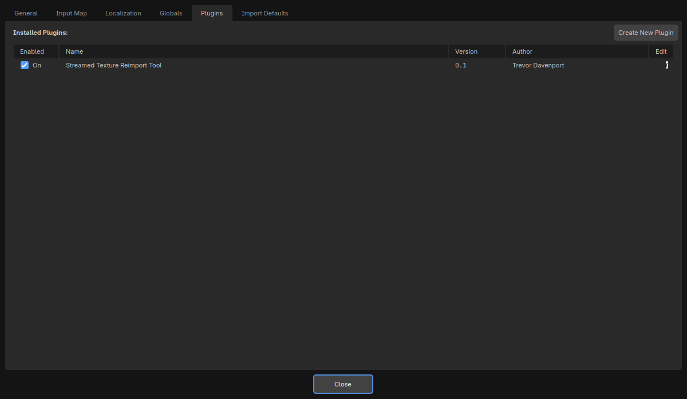
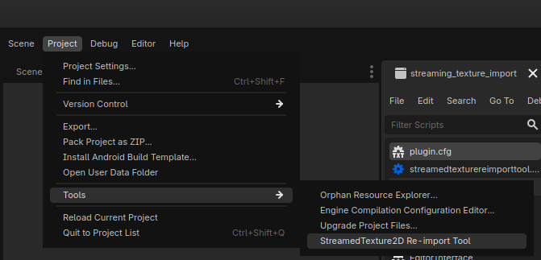
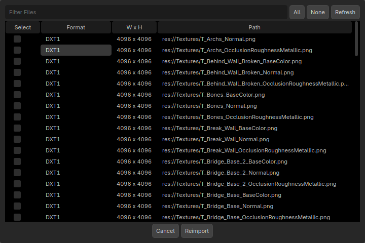

# Streamed Texture Reimport Tool

Godot 4 editor plugin that batch reimports `CompressedTexture2D` assets as `StreamedTexture2D`.

Use it to flip large texture sets to streamed import easily.

## Features

- Scans your project for compressed textures that use compression.
- Filters and bulk-selects assets in a list view.
- Rewrites `.import` metadata and triggers reimport.
- Reports any files that failed to update.

## Requirements

- Godot 4.x editor with streamed textures (see https://github.com/godotengine/godot/pull/113429)

## Install

1. Copy this folder into your project at `res://addons/streamed_texture_reimport_tool/`.
2. In Godot, open **Project Settings > Plugins** and enable **Streamed Texture Reimport Tool**.

## Usage

1. Open **Project > Tools > StreamedTexture2D Re-import Tool**.
2. Use the filter box to narrow the list.
3. Select textures, then click **Reimport**.

The tool scans `.import` files and targets textures that were imported as
`CompressedTexture2D` with GPU compression enabled, then updates the importer
to `StreamedTexture2D` before reimporting.

## Screenshots

Add the screenshots to `screenshots/` (or adjust the paths below).

Plugin Window
___

Tools menu entry
___

Reimport window
___

## Troubleshooting

- If a file fails to update, the dialog lists the paths you can copy.
- If the list looks empty, hit **Refresh** or reimport the textures once.

## License

See [LICENSE](LICENSE).
